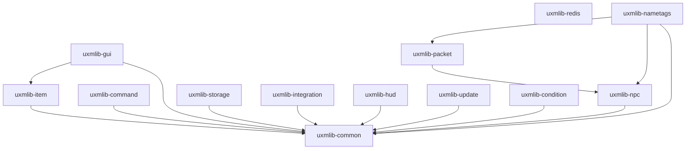

# uxmLib

[](https://github.com/UXPLIMA/uxm-lib/actions/workflows/build.yml)
[](https://jitpack.io/#UXPLIMA/uxm-lib)
[](LICENSE)
[](https://adoptium.net/)
[](https://papermc.io/)
[](https://docs.papermc.io/folia)

A modern, modular toolkit for writing **Paper 26.2+** plugins on **Java 21**. It bundles the parts every
plugin ends up re-implementing: inventory GUIs, item building, Brigadier commands, typed config, pooled
storage, soft-dependency integrations, HUD overlays, holograms, a notify-only update checker, and a
config-driven condition/action engine, behind a clean, documented API, so you stop copy-pasting the same
helpers from project to project.

It is built for **one server line, on purpose**. No cross-version reflection layers to carry around, and
no compatibility seams: just the current Paper API used the way it is meant to be used, **Folia-ready from line one**, and verified by
Error Prone, NullAway null-safety, Spotless formatting, ArchUnit architecture rules, and unit tests under
`-Werror`.

Pull only the modules you use as Maven artifacts and shade them, or drop the aggregate jar on the server
and depend on it as a normal plugin. Both work.

---

## Table of contents

- [Why uxmLib](#why-uxmlib)
- [Requirements](#requirements)
- [Modules](#modules)
- [Installation](#installation)
  - [Gradle (Kotlin DSL)](#gradle-kotlin-dsl)
  - [Gradle (Groovy DSL)](#gradle-groovy-dsl)
  - [Maven](#maven)
  - [Align versions with the BOM](#align-versions-with-the-bom)
  - [Standalone plugin jar](#standalone-plugin-jar)
  - [Shading and relocation](#shading-and-relocation)
- [Feature tour](#feature-tour)
  - [Text](#text)
  - [Style layer](#style-layer)
  - [Scheduling (Folia-ready)](#scheduling-folia-ready)
  - [Items](#items)
  - [GUIs](#guis)
  - [Commands](#commands)
  - [Configuration](#configuration)
  - [Storage](#storage)
  - [Integrations](#integrations)
  - [Holograms](#holograms)
  - [HUD overlays](#hud-overlays)
  - [Conditions & actions](#conditions--actions)
  - [Cross-server messaging](#cross-server-messaging)
  - [Update checker](#update-checker)
  - [Backup participation](#backup-participation)
  - [Experimental: packet layer](#experimental-packet-layer)
- [Architecture & quality](#architecture--quality)
- [Building from source](#building-from-source)
- [Versioning & stability](#versioning--stability)
- [Contributing](#contributing)
- [License](#license)
- [Acknowledgements](#acknowledgements)

---

## Why uxmLib

- **One platform, done well.** Paper 26.2 and up. Every API targets the current server, with no reflection
  machinery and no adapter layer to support servers that no longer exist.
- **Modular.** Each `uxmlib-*` module is published independently: take the GUI framework without the
  storage stack, or just the command DSL. Modules never depend "upward", so the graph stays a clean tree.
- **Folia-ready.** Nothing schedules through `BukkitScheduler`. The library's `Scheduler` abstraction maps
  cleanly onto Paper's global / region / entity / async schedulers, so the same plugin code runs unchanged
  on Folia.
- **Adventure-native.** All text is Adventure components built from MiniMessage. Legacy `§`/`&` colour
  codes are deliberately unsupported.
- **Null-safe and statically checked.** Every package is JSpecify `@NullMarked`; NullAway and Error Prone
  run as errors, formatting is enforced with Spotless (Palantir Java Format), and ArchUnit guards the
  module boundaries.
- **MIT, and clean-room.** Nothing is copied from GPL/AGPL/proprietary sources. The Minecraft-facing API is
  written from scratch; only neutral infrastructure (HikariCP, Caffeine, Configurate) is taken as a
  dependency. Use it anywhere, including in closed-source plugins.
- **Native where it can be.** GUIs, holograms, HUD overlays, and toasts use the public Paper/Adventure API
  (no packets, no per-version NMS), so they keep working across point releases.

## Requirements

| | |
| --- | --- |
| Server | Paper **26.2+** (the year-based line) |
| Java | **21** bytecode, built with a **25** toolchain. The server runs 25; the emitted class files stay at 21, so the modules that never touch a server can be used from an ordinary Java 21 project. |
| Build (consumers) | Gradle or Maven; the modules are plain Maven artifacts |

Adventure, MiniMessage, and Brigadier are provided by Paper at runtime: uxmLib references them at
compile time only and never ships them.

## Modules

Every module is published separately under the JitPack group `com.github.UXPLIMA.uxm-lib`; pull only
what you use. Modules marked **experimental** are previews with unstable APIs (see
[Versioning & stability](#versioning--stability)).

| Module | What it gives you |
| --- | --- |
| `uxmlib-common` | The shared foundation: a Folia-ready `Scheduler`, MiniMessage `Text`, a config-driven style layer (`Theme`/`Styler`/`Typography`/`StyleTokens`), node-based `HoconConfig` and typed-record `RecordConfig` with hot reload and live `ConfigProperty`, a MiniMessage-native i18n message catalog, a ReDoS-guarded `TimedRegex`, a `BackupParticipants` seam that lets a plugin flush its state before something copies its files, type-safe particle spawning, and `Durations`/`Numbers`/`Sounds`/`SemanticVersion`/`ServerVersion` helpers. |
| `uxmlib-item` | A fluent `ItemBuilder` (name, lore, enchantments, attributes, flags, durability, banners, components, with removers), sealed `SkullData` player heads with an async skin resolver, registry lookups for the key-based enchantments and attributes, component-safe and gzip serialization, single-key `isSimilar`, and typed persistent-data helpers. |
| `uxmlib-gui` | An inventory-menu framework: simple / paginated / scrolling / storage / typed (hopper, dispenser, …) menus; static, animated, dynamic, and per-viewer stateful items; border/row/column/rect fillers; interaction control; multi-screen navigation; menus defined in HOCON; unified anvil/chat/sign text input; the tile/lore/title/sound side of the style layer; and a facade over Paper's server-side Dialogs. |
| `uxmlib-command` | A thin facade over Paper's Brigadier (`Cmd`/`Args`/`Sender`/`CommandRegistrar`) **and** an annotation DSL on top of it: `@Command`/`@Subcommand`/`@Arg`, permissions, `@Range`/`@Length`, `@Cooldown`, flags and switches, async execution, help pagination, and resolver/validator/condition SPIs. |
| `uxmlib-storage` | Plain-JDBC persistence: a HikariCP-pooled `Database` (SQLite default; MySQL/MariaDB, PostgreSQL, H2 opt-in), an injection-safe `SelectBuilder`, parameterised `Sql`/`TxSql`, versioned migrations, a Caffeine-backed write-through / write-behind cache, a two-tier player-profile cache, and cross-server row sync. |
| `uxmlib-redis` | A low-level binary (`byte[]`) Redis pub/sub bus for fanning an opaque frame across the server nodes sharing one Redis (fail-degraded publish, per-subscription auto-reconnect), with no relational dependencies (Lettuce is a compile-only soft-dependency). |
| `uxmlib-integration` | Soft-dependency hooks reached only past a present-guard: PlaceholderAPI (read **and** expansion registration), Vault and VaultUnlocked economy, Vault permissions, LuckPerms, WorldGuard/Towny region queries, a transient advancement-toast API, an online-data lifecycle manager, a dependency-free Discord webhook, and native-`Display` [holograms](#holograms). |
| `uxmlib-hud` | Adventure-native HUD overlays, all through the public player API: a flicker-free diffing sidebar, title/subtitle, a sticky action bar, boss bars with a mode enum (permanent/filling/countdown/dynamic), tablist header/footer, per-tick text animators, and a nametag registry that composes several plugins' prefixes, suffixes and colours onto the one team a player may belong to. |
| `uxmlib-update` | A notify-only release update checker (GitHub / Modrinth providers) that compares a build-time version constant against the latest release and surfaces a permission-gated clickable join message. It never self-downloads. |
| `uxmlib-condition` | A declarative condition engine (operand comparison + placeholder resolution + failure policy) and its natural pair, a config-driven action engine (`[message]`, `[console]`, `[title]`, … parsed once into closures). |
| `uxmlib-npc` | **Experimental.** A from-scratch, MIT-clean Netty pipeline foundation: channel resolve, idempotent inject/eject, a self-healing reorder watchdog, and a fail-open listener seam. Groundwork for the packet layer; no NPC yet. |
| `uxmlib-packet` | **Experimental.** The shared Mojang-mapped packet helpers (Adventure→vanilla component conversion, bundling, the stream-codec buffer trick, guarded reflection, entity-id allocation) plus per-viewer tab-list, NPC, and text-display packet ports built on them. |
| `uxmlib-nametags` | **Experimental.** A from-scratch per-viewer nametag renderer (different prefixes/colours/visibility per viewer) over scoreboard-team and metadata packets, without touching the server-side scoreboard. |
| `uxmlib-bom` | A bill of materials so a consumer can align every `uxmlib-*` artifact to one version with a single platform import. |
| `uxmlib-all` | The aggregate of every module on the API surface. The same module also builds the standalone server-side plugin jar, published beside it under the `standalone` classifier. |



## Installation

uxmLib is published through [JitPack](https://jitpack.io/#UXPLIMA/uxm-lib). Add the JitPack repository
(plus Paper's, since the modules compile against the Paper API), then the modules you need. JitPack serves
each module under the group `com.github.UXPLIMA.uxm-lib` with the git tag as the version.

> Replace `VERSION` with the latest released tag, the version shown on the JitPack badge above.
> There is no `com.github.UXPLIMA:uxm-lib` artifact: the group carries the repository name after a
> dot, and the coordinate always ends in a module.

> **The repository used to be called `uxmLib`.** Builds that ask for the old group
> `com.github.UXPLIMA.uxmLib` still resolve: GitHub redirects the old repository path, JitPack follows
> it, and every version built before the rename stays served from its cache. New builds should use
> `com.github.UXPLIMA.uxm-lib`. The old group works, but it rests on that redirect, and the redirect
> would be lost the moment anything else claimed the name `uxmLib` under this account, so nothing
> should ever be published under that name again.

### Gradle (Kotlin DSL)

```kotlin
repositories {
    mavenCentral()
    maven("https://repo.papermc.io/repository/maven-public/")
    maven("https://jitpack.io")
}

dependencies {
    implementation("com.github.UXPLIMA.uxm-lib:uxmlib-gui:VERSION")
    implementation("com.github.UXPLIMA.uxm-lib:uxmlib-item:VERSION")
    implementation("com.github.UXPLIMA.uxm-lib:uxmlib-command:VERSION")
    // ...and uxmlib-common / uxmlib-storage / uxmlib-integration / uxmlib-hud /
    // uxmlib-update / uxmlib-condition as needed
}
```

### Want the whole surface in one line

`uxmlib-all` depends on every module, so declaring it pulls them all in:

```kotlin
dependencies {
    implementation("com.github.UXPLIMA.uxm-lib:uxmlib-all:VERSION")
}
```

### Gradle (Groovy DSL)

```groovy
repositories {
    mavenCentral()
    maven { url 'https://repo.papermc.io/repository/maven-public/' }
    maven { url 'https://jitpack.io' }
}

dependencies {
    implementation 'com.github.UXPLIMA.uxm-lib:uxmlib-gui:VERSION'
    implementation 'com.github.UXPLIMA.uxm-lib:uxmlib-item:VERSION'
}
```

### Maven

```xml
<repositories>
  <repository>
    <id>papermc</id>
    <url>https://repo.papermc.io/repository/maven-public/</url>
  </repository>
  <repository>
    <id>jitpack.io</id>
    <url>https://jitpack.io</url>
  </repository>
</repositories>

<dependency>
  <groupId>com.github.UXPLIMA.uxm-lib</groupId>
  <artifactId>uxmlib-gui</artifactId>
  <version>VERSION</version>
</dependency>
```

### Align versions with the BOM

Importing the BOM lets you list modules without repeating the version on each one:

```kotlin
dependencies {
    implementation(platform("com.github.UXPLIMA.uxm-lib:uxmlib-bom:VERSION"))

    implementation("com.github.UXPLIMA.uxm-lib:uxmlib-gui")
    implementation("com.github.UXPLIMA.uxm-lib:uxmlib-item")
    implementation("com.github.UXPLIMA.uxm-lib:uxmlib-storage")
}
```

### Standalone plugin jar

Prefer not to shade? Take the standalone jar, drop it in the server's `plugins/` folder, and have your
plugins depend on it as a normal Paper dependency:

```yaml
# paper-plugin.yml
depend:
  - uxmlib
```

The standalone jar registers only the handful of listeners whose behaviour is driven entirely by item
persistent data; the rest of the library is consumed as an API.

It is a separate artifact from the aggregate you compile against: same module and version, `standalone`
classifier, because it bundles Configurate, HikariCP and Caffeine under relocated package names. Compiling
against relocated types would put classes on your compile classpath that no consumer can produce. Grab it
from the release assets, from Maven, or build it yourself:

```kotlin
// only if you need the file itself, e.g. to copy it into a server image
dependencies {
    runtimeOnly("com.github.UXPLIMA.uxm-lib:uxmlib-all:VERSION:standalone")
}
```

```bash
./gradlew :uxmlib-all:shadowJar   # build/libs/uxmlib-all-VERSION-standalone.jar
```

### Shading and relocation

When you shade individual modules into your own jar, relocate `com.uxplima.uxmlib` to avoid clashing with
another plugin that also bundles uxmLib:

```kotlin
tasks.shadowJar {
    relocate("com.uxplima.uxmlib", "com.yourplugin.libs.uxmlib")
}
```

The config and storage layers locate their codecs through the JDK `ServiceLoader`. If you enable the Shadow
plugin's `minimize()`, keep the service-provider files and their backing classes, or config parsing will
fail at runtime with a missing-serializer error:

```kotlin
tasks.shadowJar {
    minimize {
        exclude("META-INF/services/**")
        exclude(dependency("org.spongepowered:configurate-.*:.*"))
    }
}
```

## Feature tour

The examples below assume the MiniMessage text helper is imported:

```java
import com.uxplima.uxmlib.text.Text;
import net.kyori.adventure.text.Component;
```

### Text

`Text` is the single place a plugin turns a MiniMessage string into an Adventure `Component`.

```java
Component title = Text.mini("<gradient:#ff5555:#ffaa00>Welcome</gradient>");
Component greet = Text.mini("<gray>Hello, <player>!", Text.placeholder("player", name));

String plain = Text.plain(title);     // strip formatting for logs
String mm    = Text.serialize(title); // round-trip back to MiniMessage
```

Text a player typed is never a MiniMessage string. `paint` applies a style from your config to a body that
stays literal, so a chat message reading `<click:run_command:/op me>free rank</click>` is shown, not run:

```java
Component line = Text.paint(message, config.getString("chat.format-style")); // e.g. "<gray>"
```

### Style layer

A palette, the letters an interface is set in, and the tokens a message file writes instead of colours,
so a server changes its whole look by editing one file, and no plugin ships a hex code.

A theme has three layers. `palette` is the server's own colours under the server's own names, and nothing
outside that file speaks those names, so any of them may be renamed or dropped. `roles` is the shared
vocabulary a message writes: `accent`, `value`, `good`. Each role points at a palette name or a hex code,
and the map is open, so a server may add a job of its own and use it as a tag the same day. `wheel` is an
ordered list of colours that decoration is taken from, so a screen of tiles can differ tile by tile without
any file naming a colour.

```java
// One file for the whole server, with this plugin's own file on top of it, key by key.
Theme theme = ThemeFiles.load(ThemeFiles.shared(dataFolder), dataFolder.resolve("theme.conf"));
Styler styler = new Styler(theme);

// A catalog line names a role, never a colour:
//   join.welcome = "<tag:'HOME'><body>Welcome back, <value><player></value>"
messages.reload(styler.style(catalog, MyKeys.values(), files, Locale.ENGLISH));

// On a /reload, hand the same styler the new palette rather than building a second one:
styler.reload(ThemeFiles.load(ThemeFiles.shared(dataFolder), dataFolder.resolve("theme.conf")));

// Text a plugin computes has no catalog entry to style at load, so style it per viewer, and ask
// Messages which language that viewer is being served rather than reading the player's own locale,
// or a server that pins one gets catalog text in one language and computed text styled for another.
Component name = Text.mini(styler.apply(colour.displayName(), messages.localeOf(viewer)));
```

`Typography` converts a template to small capitals for the languages the theme names, leaving tags,
placeholders and anything inside `<plain>…</plain>` alone, so a translator writes ordinary words and nothing
rewrites the file they work in. It names none until your `theme.conf` does: a typeface is taste, and a
library that wrote your English in small capitals by itself would repaint a plugin that only wanted the
colours. `StyleTokens` then turns `<accent>`/`<value>` into the
theme's colours and `<tag:'HOME'>` into a bold category prefix. Both run once at load, not per message.

A value is inserted after that pass and is never converted, because a name, a nickname and a world are what
a player wrote. When a value is the interface talking instead (the name of an item, the word for a state),
write `<caps>…</caps>` around it and it is converted at render:

```
listed = "You listed <caps><item></caps> for <money><price>"   // the item is converted, the player is not
```

It is the mirror of `<plain>…</plain>` and it follows the same language list: turn small capitals off in
`theme.conf` and every `<caps>` goes quiet with the rest, so a screen is never half converted. Small
capitals are Latin only, so a language whose letters have no small-capital form simply does not write the
tag, which is why the choice is one line at a time rather than one switch for the server.

Menus draw from the same theme: `MenuTitles.centre` pads a window title into the middle of the frame,
`Tiles` puts a tile's title on the first lore line under a blank name (a single space: an empty one makes
the client fall back to the material's name) and paints it with a gradient the caller names, `Lore` builds
the tooltip in one fixed order and wraps a description at a width the caller may set, and
`MenuSounds` reads the three menu sounds from config. Lore an operator wrote in a config file goes through
`Lore.lines`, which reads every line as body text and gives it the same column, padding and closing air as
lore built here, so a plugin that ships items never has to write that geometry down as a house rule of its
own. A file that draws its own glyphs and its own margins goes through `Lore.verbatim` instead, which adds
the padding and the closing air and leaves the geometry alone, so a plugin can still let its buyer write a
look that is nothing like this one.

The library ships `uxmlib/theme.conf` as a starting file: the palette, the roles, the wheel, the glyphs,
the category colours, named gradients and which languages take small capitals. A key it leaves out keeps the shipped answer, and naming
one language never decides for the others. The shipped file turns nothing on that a look would notice: the
small capitals block is an example, commented out. A `gradients { header = [...] }` block paints every `<h:'…'>`
header across those stops; leave the block out and headers stay the flat accent colour, which is what the
shipped file does.

A name that is not a heading takes `<g:'UXM Network':wheel>`: the same lookup as a heading, painted across
every colour of the wheel in order, with no bold and in the letters the file wrote. That is the one token a
server list line or a title screen usually wants, and it keeps the seven colours in the theme rather than in
the file.

A heading may take its colour three ways, and the file that draws it picks the one that fits. The wheel is
the one that needs no name: `Tiles.titled(theme, title, lore, position)` paints the tile at that position
with that arc of the wheel, so twelve tiles read as twelve headings and the layout file stays free of
colour. A content file reaches the same wheel by writing the position in the token, `<h:'REWARDS':4>`,
which is what a hotbar or a list written in configuration uses. A heading that always means the same thing
names a role instead, `<h:'REWARDS':good>`. A sweep of your own is a named gradient in the file,
`<h:'REWARDS':mint>`. The library never picks for you: which tiles look alike is a decision about one
interface, and only the file that knows what the tiles are about can make it.

### Scheduling (Folia-ready)

One `Scheduler` interface covers Paper's four schedulers; build it once and inject it everywhere. Every
method returns a cancellable `TaskHandle`, so your plugin never touches `BukkitScheduler` and runs
unchanged on Folia.

```java
Scheduler scheduler = new PaperScheduler(plugin);

scheduler.global(() -> broadcast());                                  // next tick, global region
scheduler.regionLater(location, Duration.ofSeconds(2), () -> grow()); // region-threaded
scheduler.entityTimer(player, Duration.ZERO, Duration.ofSeconds(1),
        handle -> { if (done) handle.cancel(); });                    // entity-threaded, repeating
scheduler.async(() -> fetchFromApi());                                // off the main thread
```

### Items

```java
ItemStack sword = ItemBuilder.of(Material.DIAMOND_SWORD)
        .name(Text.mini("<gradient:#ff5555:#ffaa00>Flameblade</gradient>"))
        .lore(Text.mini("<gray>A legendary weapon"))
        .enchant(Items.enchantment("sharpness"), 5)   // enchantments are registry entries
        .flags(ItemFlag.HIDE_ENCHANTS)
        .unbreakable(true)
        .build();

ItemStack head = ItemBuilder.of(Material.PLAYER_HEAD)
        .skull(SkullData.ofName("Notch"))
        .build();

String saved = ItemSerialization.toBase64(sword);  // survives every data component
ItemStack back = ItemSerialization.fromBase64(saved);

// A menu icon is a button, and the client does not know that: it writes its own lines under the lore,
// so a leather chestplate used as a button says "Dyed" and "Armor" beneath whatever the menu wrote.
ItemStack button = ItemBuilder.of(Material.LEATHER_CHESTPLATE)
        .name(Text.mini("<white>Cosmetics"))
        .vanillaTooltip(false)          // or hiddenComponents(...) to keep one of them
        .build();
```

`ItemConfig` reads the same spec from HOCON, `hide-vanilla-tooltip = true` included, so an operator writing
a menu file reaches for that rather than for the deprecated `HIDE_ADDITIONAL_TOOLTIP` flag. Leave it off for
an item a player owns: on a kit sword or a vault icon the damage and enchantment lines are the point.

### GUIs

Install the framework once in `onEnable`, then build menus fluently. Clicks are cancelled by default: an
unconfigured menu can never leak items.

```java
Guis.install(plugin, scheduler);   // the Scheduler overload enables animation and auto-refresh

SimpleGui menu = Guis.gui().title(Text.mini("<dark_aqua>Menu")).rows(3).build();
menu.filler().fillBorder(GuiItem.display(pane));        // border / row / column / rect / fill helpers
menu.set(2, 5, GuiItem.button(icon, e -> click()));     // 1-indexed row, col
menu.onClose(event -> persist());
menu.open(player);

// Paginated, scrolling, and non-chest shapes:
PaginatedGui shop = Guis.paginated().title(Text.mini("Shop")).rows(6).build();
products.forEach(p -> shop.addPageItem(GuiItem.button(p.icon(), e -> buy(p))));
shop.open(player);

ScrollingGui list = Guis.scrolling(ScrollType.VERTICAL).rows(4).build();

// A storage menu holds real items (take/place allowed) and keeps them across opens:
StorageGui vault = Guis.storage().rows(3).build();
vault.onClose(e -> save(vault.contents()));

// Per-viewer items: dynamic (computed per player), stateful (first matching state), animated:
menu.set(4, GuiItem.dynamic(ctx -> headOf(ctx.viewer())));
menu.set(5, GuiItem.stateful()
        .display(ctx -> ctx.viewer().hasPermission("vip"), vipIcon)
        .display(ctx -> true, normalIcon)
        .build());
menu.set(6, GuiItem.animated(List.of(frame1, frame2), Duration.ofMillis(250)));

// Multi-screen navigation with a back-stack:
GuiNavigator nav = new GuiNavigator();
nav.open(player, mainMenu);
subMenu.set(8, GuiItem.back(nav, backArrow));

// Define a menu in HOCON (operators re-skin; code owns the actions):
MenuActions actions = new MenuActions().register("buy", e -> openShop(e));
SimpleGui fromFile = MenuConfig.load(configNode, actions);
```

`MenuConfig` reads the mask shape. A second shape names its slots, so a suite of plugins can ship one
kind of menu file: an operator who has laid out one has laid out all of them.

```hocon
title = "@shop.title"
rows = 6
open-actions = ["sound:ITEM_BOOK_PAGE_TURN 0.7 1.2"]

items {
  filler { slots = ["0-53"], material = GRAY_STAINED_GLASS_PANE, name = " ", priority = 0 }
  buy {
    slot = 49, material = EMERALD, name = "@shop.buy", priority = 10
    view  = ["has-permission shop.buy"]
    click { left = ["shop:buy", "close"], right = ["shop:look"] }
  }
  offers {
    slots = ["10-16"], priority = 5
    list { source = "shop:offers", template { material = "%icon%", name = "@shop.offer" } }
  }
  next { slot = 53, material = ARROW, type = next, priority = 10 }
}
```

`MenuSpec.read` turns the file into values and refuses a layout that cannot be drawn, with no server
running. `MenuDraw` draws it, centring the title through `MenuTitles.centre`: it wires the four sides of a click through `MenuActionRunner`, hides an item
whose `view` conditions fail, and fills a `list` from the source the plugin registered. A menu with a list
is drawn as a paged window over the slots the list names.

```java
MenuLists lists = new MenuLists().register("shop:offers", viewer -> offersFor(viewer).stream()
        .map(offer -> MenuLists.Row.of(offer.icon(), Map.of("%price%", offer.price())))
        .toList());

MenuDraw draw = new MenuDraw(actions, conditions, lists, this::words, this::openMenu);
draw.open(MenuSpec.read(configNode), player);
```

A row carries the values and never the look: the file still writes the name and the lore over the icon the
row gives. Every line a player reads goes through the `Words` the plugin passed, which looks a key such as
`@shop.title` up in the catalogue, writes the values of the row in, and paints the result in the colours of
the server. The library parses no text of its own, so it decides no look and holds no language.

### Commands

Both styles register through Paper's Brigadier lifecycle. Use the annotation DSL for the common case, or
the `Cmd` facade when you need to hand-build a node tree.

```java
@Command(name = "money", description = "Manage balances")
class MoneyCommand {

    @Subcommand("pay")
    @Permission("money.pay")
    void pay(Sender sender, @Arg("target") String target, @Arg(value = "amount", min = 1) int amount) {
        sender.send(Text.mini("<green>Paid " + amount + " to " + target));
    }
}

AnnotatedCommands.register(plugin, new MoneyCommand());
```

```java
// Or build the tree yourself:
CommandRegistrar.register(plugin,
        Cmd.literal("ping").requires(Cmd.permission("x.ping"))
                .executes(ctx -> {
                    Sender.of(ctx.getSource()).send(Text.mini("pong"));
                    return Cmd.OK;
                }),
        "Replies with pong");
```

The annotation layer also covers `@Range`/`@Length` bounds, `@Cooldown` rate limits, `@PlayerOnly`, flags
and switches, async execution, and paginated help, with SPIs for custom argument resolvers, validators,
and conditions.

Everything the command layer says on its own behalf: the refusals, the argument rejections, the whole
generated help page down to the separator between a command and its description, goes through
`CommandMessages`, so a translated plugin answers each player in that player's own language and paints the
answer in its own palette:

```java
ParamResolvers resolvers = ParamResolvers.withDefaults()
        .messages(myMessages)                                   // implement only the lines you care about
        .locales(LocaleSource.ofDefault(Locale.forLanguageTag("tr")));

AnnotatedCommands.register(plugin, new HomeCommand(), resolvers);
```

A plugin that already has a message catalog needs none of that by hand: `CommandMessages.fromCatalogue(messages)`
reads every line from the catalog under the `CommandLine` keys (`command.player-only`, `command.help-header`, and
the rest), so the command layer is translated and painted with everything else, and an operator can re-word any
of it in their language file.

Each method receives the sender's locale and the *values*: the bad input, the allowed ones, the time left.
Never a finished English sentence, since no other language puts those words in the same order. Every
method has a default, so a plugin that ignores the seam keeps the English it always had.

The help page is worth overriding even in an English-only plugin: `helpCommand`, `helpSeparator` and
`helpDescription` are the only way to restyle it, because that text is generated inside this jar and no
style pass over a plugin's own resources can see it.

### Configuration

Typed configuration over Configurate (HOCON): config is data with IDE support, not string-keyed lookups.

```java
HoconConfig config = HoconConfig.load(dataFolder.resolve("config.conf"));

int limit = config.getInt("homes.limit", 3);

ConfigProperty<Integer> live = config.intProperty("homes.limit", 3);
live.onChange(value -> rebuildLimits(value));   // fires on reload when the value changes
config.reload();
```

```java
// Or map a whole file onto one @ConfigSerializable record, hot-reloaded as an atomic snapshot:
RecordConfig<Settings> settings =
        new RecordConfig<>(dataFolder.resolve("settings.conf"), Settings.class, Settings::new);

Settings current = settings.current();   // cached snapshot: cheap on the hot path
settings.reload();                        // swaps in the new value, or keeps the prior one on a parse error
```

### Storage

```java
Database db = Database.builder().sqlite(dataFolder.resolve("data.db")).build();  // SQLite default, WAL
Sql sql = new Sql(db);
sql.execute("CREATE TABLE IF NOT EXISTS players (uuid TEXT PRIMARY KEY, coins INTEGER)");

// Versioned migrations run exactly once each, in order:
new MigrationRunner(db).apply(List.of(
        new Migration(1, "init", "CREATE TABLE warps (name TEXT PRIMARY KEY)")));

// Injection-safe query builder with bound parameters:
Query top = SelectBuilder.from("players")
        .where("coins", ">=", 100)
        .orderByDescending("coins")
        .limit(10)
        .build();
List<String> leaders = sql.query(top, row -> row.getString("uuid"));
```

Switch to a network backend by giving the builder a JDBC URL and credentials (`jdbcUrl(...)`,
`username(...)`, `password(...)`) and adding the matching driver: MariaDB/MySQL, PostgreSQL, and H2 are
opt-in. The URL decides the backend: hand `jdbcUrl(...)` a `jdbc:sqlite:` file and you get the same
single-writer pool, WAL journal and lock timeout `sqlite(...)` gives you, so exposing one `jdbc-url` setting
to your operators is safe whichever backend they point it at. Higher-level helpers add a write-through / write-behind cache, a two-tier player-profile cache, and
cross-server row sync.

### Integrations

Every third-party symbol is touched only past a plugin-present guard, so a server without the soft-dependency
still loads cleanly.

```java
// Economy: resolves Vault or VaultUnlocked, with a no-op dummy so call sites never null-check.
EconomyBridge.orDummy().deposit(player, 100);

// Permissions / ranks via LuckPerms, present-guarded:
LuckPermsHook.find().flatMap(lp -> lp.prefix(player)).ifPresent(prefix -> applyPrefix(prefix));

// PlaceholderAPI: a no-op pass-through without PlaceholderAPI installed:
String text = Placeholders.apply(player, "Hi %player_name%");

// Region queries against WorldGuard or Towny behind one provider-agnostic contract:
RegionHooks regions = new RegionHooks();
WorldGuardRegionService.find().ifPresent(regions::register);   // present-guarded
boolean canBuild = regions.active()
        .map(region -> region.canBuild(player, location))
        .orElse(true);

// A transient toast that leaves no persistent advancement behind:
Toast.builder()
        .icon(Material.DIAMOND)
        .title(Text.mini("<gold>Objective complete!"))
        .show(player);

// A dependency-free Discord webhook (no JDA, no bot token):
new DiscordWebhook(url).sendEmbed(DiscordEmbed.colored("Alert", "Server started", 0x00FF00));
```

The PlaceholderAPI integration also has a write side: register a `PlaceholderProvider` to expose your own
`%uxm_<prefix>_<params>%` placeholders. A provider is asked about an `OfflinePlayer`, because that is what a
leaderboard line, a tab-list entry and a hologram name; narrow it with `instanceof Player` when the answer
needs a player who is here.

### Holograms

Holograms are built on native `Display` entities (Text / Item / Block): no packets, no per-version
NMS, and managed for you so visibility, per-viewer content, and cleanup are handled automatically.

```java
HologramManager holograms = new HologramManager();
holograms.installLifecycleListener(plugin);   // resets per-player state on quit / world change

Hologram spawn = holograms.spawn(
        Holograms.builder()
                .line(Text.mini("<yellow><bold>Spawn"))
                .line(Text.mini("<gray>Welcome to the server"))
                .billboard(Display.Billboard.CENTER)
                .glow(Color.YELLOW),
        location);
```

On top of that base the module adds a distance-driven visibility `HologramPool`, per-player widgets
(paged, switchable, live leaderboard), entity-following holograms, text animation (typewriter / scroll),
a Mojang skin resolver for player-head displays, and holograms defined in HOCON.

### HUD overlays

Adventure-native overlays delivered through Paper's own player API: no packets, no NMS.

```java
// Flicker-free sidebar: only the lines that actually changed are re-sent.
SidebarManager sidebars = new SidebarManager(Bukkit.getScoreboardManager());
Sidebar sb = sidebars.create(player, Text.mini("<gold><bold>Server"));
sb.lines(List.of(
        Text.mini("<gray>Online: <white>42"),
        Text.mini("<gray>Map: <white>spawn")));
sb.show();

new Titles().show(player, Text.mini("<green>Welcome"), Text.mini("<gray>have fun"));
new Tablist().set(player, header, footer);

new ActionBarManager(scheduler, server).show(player, Text.mini("<yellow>Saved!"), Duration.ofSeconds(3));
new BossBarManager(scheduler, server).countdown(player, Text.mini("<red>Event"), Duration.ofMinutes(1));
```

A player may belong to exactly one scoreboard team, so plugins that each create their own teams overwrite
one another's nametags without saying so. `NametagRegistry` owns the team instead, and every plugin hands it
a contribution:

```java
NametagRegistry nametags = new NametagRegistry(
        new ScoreboardNametagSink(Bukkit.getScoreboardManager().getMainScoreboard(), getLogger()),
        getLogger(),
        " ",        // what goes between two contributed parts
        scheduler); // the scoreboard belongs to the global region

nametags.contribute(player, NametagContribution.prefix("uxmTags", priorityFromConfig, Text.mini("<gold>[VIP]")));
nametags.contribute(player, NametagContribution.color("uxmGlow", priorityFromConfig, NamedTextColor.RED));

nametags.withdraw("uxmTags"); // onDisable: take back only your own parts
```

Prefixes and suffixes compose in priority order (smaller is earlier), and priority decides layout. The name
has a single colour, so one claim has to win, and which one is your server's rule rather than the library's:
pass a `ComposedNametag.ColorOwner` as the fifth constructor argument. `newest()` is the default and gives
the colour to whoever asked last, so a glow a player just switched on wins over a rank tag that has sat
leftmost all session. `byPriority()` gives it to the smallest priority instead, which is what an estate that
sells a rank colour wants. Write your own for anything else. Every claimant is named once in the log,
together with the winner.
Read your priority from your own config: which of two plugins comes first is an operator's decision. A team
uxmLib did not create is never touched, so a third-party plugin managing its own teams is left alone.

### Conditions & actions

A config-driven gate plus a config-driven action list: both parsed once and run many times.

```java
// Resolve %...% through an injected resolver, compare, and collect a failure message:
ConditionList gate = ConditionList.of(
        PlaceholderCondition.parse("%player_level% >= 30"),
        Text.mini("<red>You need level 30"));
boolean allowed = gate.test(ConditionRequest.forPlayer(player));

// Named actions parsed once into closures and run in order:
ActionList.parse(List.of(
        "[message] <green>Hi %player_name%",
        "[console] heal %player_name%")).run(context);
```

### Cross-server messaging

`uxmlib-redis` is a lean binary pub/sub primitive for fanning a message across the nodes sharing one Redis,
with no relational dependencies. For cache invalidation tied to the storage stack, `uxmlib-storage` builds
its `DataSynchronizer` on the same idea: a `LocalDataSynchronizer` single-node default that a
`RedisDataSynchronizer` bridges across nodes when Redis is configured.

```java
bus.subscribe("party-updates", frame -> applyUpdate(frame));   // RedisBus: opaque byte[] frames
bus.publish("party-updates", encode(update));                  // fail-degraded, auto-reconnecting
```

### Update checker

Notify-only: it logs to the console and shows a permission-gated clickable message on join. It never
self-downloads.

```java
UpdateChecker checker = new UpdateChecker(
        scheduler, new GitHubReleaseProvider("you", "your-plugin"), UxmLibVersion.VERSION);

new UpdateNotifier(plugin, scheduler, checker, "yourplugin.update.notify")
        .start(Duration.ofSeconds(40), Duration.ofHours(6));
```

### Backup participation

A plugin that keeps state in memory has, at any moment, work that a file copy would miss. Register once, and
whatever is about to copy the server's files asks you to save first.

```java
// In your plugin, on enable.
BackupParticipants.register(plugin, () -> profiles.saveAll());

// In a backup tool, before it reads anything. The executor decides which thread a save runs on.
List<String> late = BackupParticipants.prepareAll(Duration.ofSeconds(20), mainThreadExecutor);
```

The contract is a plain `Runnable` on purpose. Every plugin relocates its shaded copy of uxmLib, so an
interface of ours would be a different class in each jar. `Runnable` comes from the boot class loader, so it
is the same type everywhere. Registrations are marked, and an unmarked `Runnable` service is never run.

### Experimental: packet layer

`uxmlib-npc`, `uxmlib-packet`, and `uxmlib-nametags` are an in-progress, **clean-room** packet foundation
for the things the public API cannot do per viewer: different nametag colours, tab-list rows, or holograms
for different players. PacketEvents (the off-the-shelf choice) is GPL, so none of it is borrowed; the Netty
plumbing is re-implemented for Paper 26.2+ and the unavoidable NMS is quarantined to single, named classes
behind pure ports built against the Mojang-mapped dev bundle.

Those classes are compiled against the Mojang-mapped server they run on, so every internal they touch is a
checked fact rather than a reflected guess. There is no adapter layer and no per-line seam: one server line
means the compiler covers the whole surface, and a server internal that moves fails the build rather than
someone's server.

These modules have **unstable APIs** and parts are still landing. Treat them as a preview; the stable
toolkit above does not depend on them.

## Architecture & quality

- **Package root** `com.uxplima.uxmlib`, one sub-package per concern, every package `@NullMarked`.
- **No upward dependencies.** `common` depends on nothing internal; everything may depend on `common`;
  `gui` depends on `item`; `all` aggregates. ArchUnit tests enforce that there are no cycles.
- **Constructor injection, no static mutable state.** The only `JavaPlugin` is the thin shell in
  `uxmlib-all`; library types are plain objects you construct and inject.
- **Input validation at every public entry**, small methods and classes, no SQL string concatenation, no
  empty catches, no `printStackTrace`.
- **Static analysis as errors.** Error Prone + NullAway (`onlyNullMarked`, JSpecify), Spotless with
  Palantir Java Format, all under `-Werror`.
- **Tests.** JUnit 5, AssertJ, Mockito, MockBukkit, jqwik property tests, and ArchUnit.

## Building from source

Requires a JDK 21 toolchain (Gradle provisions it via the Foojay resolver if needed).

```bash
./gradlew build                   # compile, format check, static analysis, tests
./gradlew spotlessApply           # auto-format before checking
./gradlew :uxmlib-all:shadowJar   # the standalone plugin jar (-standalone classifier)
./gradlew publishToMavenLocal     # install every module to ~/.m2 to try locally
```

## Versioning & stability

The library follows semantic versioning. Public API modules aim for stable names and documented seams; the
**experimental** modules (`uxmlib-npc`, `uxmlib-packet`, `uxmlib-nametags`) may change without notice until
they graduate. Pre-1.0 (`0.x`) releases may still adjust APIs between minor versions as the surface settles.

## Contributing

Issues and pull requests are welcome. The workflow is test-first: add a failing test, write the minimum
implementation, run `./gradlew spotlessApply` then `./gradlew build` green before committing. Keep to the
existing conventions: `@NullMarked` packages, constructor injection, no upward module dependencies, and
Adventure/MiniMessage for all text.

## License

[MIT](LICENSE): © UXPLIMA. Use it anywhere, including in closed-source plugins.

## Acknowledgements

uxmLib is an independent, clean-room implementation. Where a permissively licensed project informed an
approach: Triumph GUI and AnvilGUI (menu and anvil-input patterns), Item-NBT-API and Rtag (item data),
Lamp (command annotations), HamsterAPI (the pipeline-injection technique), and FancyHolograms (the
per-viewer text-override approach), it is acknowledged here. No code is copied from any GPL/AGPL or
proprietary source.
